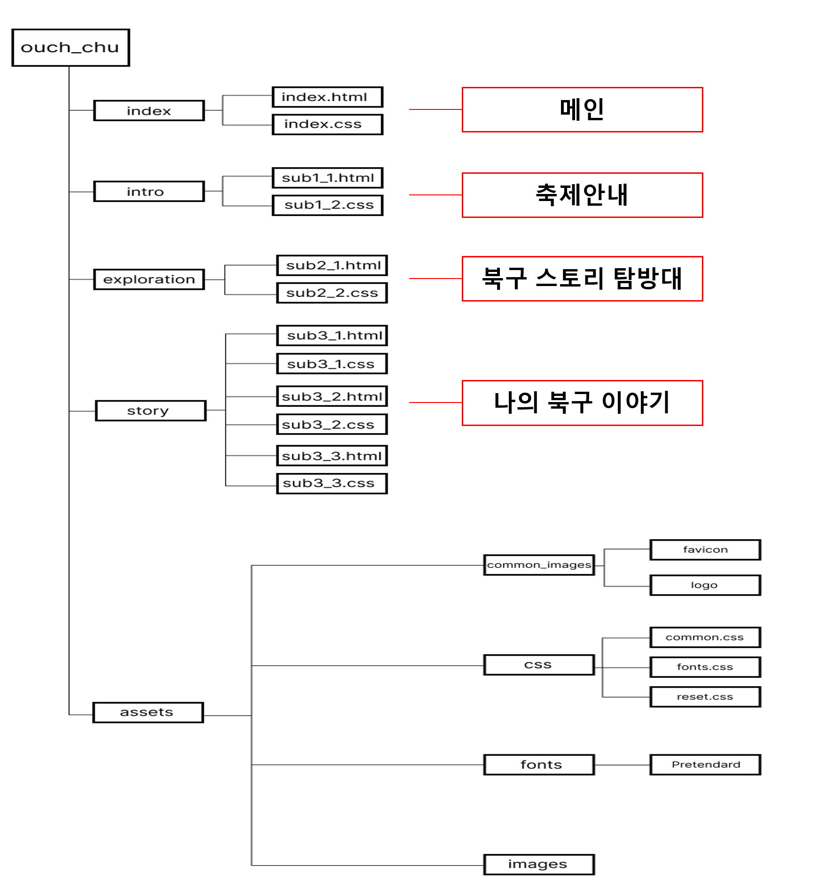

# 💌 Team ouch-chu

> Project site: [click🌐](https://ouch-chu.github.io/index/index/index.html) 
> 프로젝트 완료보고서: [click🌐](https://www.notion.so/b24568dacfce496a8695ee9f9337eefd?pvs=4) 
> 발표 PPT: [click🌐](<a href="./작업자료/부산 스토리텔링 협의회.pptx">) 

## 1. 프로젝트 개요

- 모든 팀원이 “부산 스토리텔링 협의회” 의 각 담당 페이지를 구현해 구현한 페이지를 합쳐 웹 개발에 필요한 능력을 향상시킨다

## 2. 기획 의도 & 목표

### 목표

- 모든 팀원이 함께 정해진 시간 내에 “부산 스토리텔링 협의회” 의 페이지를 구현한다.
- 홈페이지에 필요한 기능 파악 후 필요한 능력을 학습하여 개인의 능력을 향상시킨다.
- 미디어 쿼리를 통한 반응형 웹 작업에 익숙해 질 수 있도록 한다.

## 3. 작업순서

**1)** 레퍼런스 사이트 선정 
**2)** 각 어떤 페이지 구현할지 담당 페이지 분담. 
**3)** 구현하기 전 figma로 mobile, pc버전 마크업 
**4)** 홈페이지 구현에 필요한 공용으로 들어가는 부분 asstes 폴더에 정리 (font, common … ) 
**5)** 각자 맡은 페이지 구현 작업 (html → css → js 순서) 
**6)** 각자 완성된 페이지 연결작업 
**7)** 연결 후 일어나는 오류와 위치값 수정 
**8)** 작업 마무리 및 발표 준비 

## 4. 사용 기술

**1) 프로젝트 관리**

- Git Hub

**2) 개발 Tool**

- visual studio code

**3) 사용기술**

- Swiper, animation

**4) 개발 외 문서 작성**

- Figma(마크업)
- PowerPoint(발표)
- Notion(퍼블리싱가이드)

## 5. 각 담당 업무

**1) 역할 분담**

| 역할 |  이름  |                         담당                         |
| :--: | :----: | :--------------------------------------------------: |
| 리더 | 성영은 |     퍼블리싱 가이드 작성 / 프로젝트 보고서 작성      |
| 팀원 | 이성수 | 전체 파일 관리 / 요구분석과 구조분석 작성 / PPT 제작 |
| 팀원 | 이현범 |                       ppt 제작                       |
| 팀원 | 허수인 |                 ppt 제작 / ppt 발표                  |

**2) 작업 분담**

|  이름  |                         담당 작업 파트                         |
| :----: | :------------------------------------------------------------: |
| 성영은 |              북구 스토리 탐방대(sub2) 페이지 구현              |
| 이성수 | 나의 북구 이야기(sub3) 페이지 구현 / header와 footer 영역 구현 |
| 이현범 |                   축제안내(sub1) 페이지 구현                   |
| 허수인 |                    메인(index) 페이지 구현                     |

## 6. 프로젝트 내용

### 디렉토리 구조

### main 페이지 구성

**1) header**

- 로고 이미지와 대메뉴, 로그인 버튼으로 구성 mobile버전에서 대메뉴를 span으로 햄버거 바 모양을 만듬.
- mobile버전과 pc버전 동일하게 각 sub페이지 링크를 걸어두어 해당 페이지로 이동할 수 있게 함.

**2) index**

- 각 sub페이지 안에 들어있는 내용들을 간추려 미리 보기 되어있는 형식의 main 페이지.
- loop형식의 텍스트는 한 section안에 두개의 div를 만들어 위아래 서로 반대 방향으로 이동 되게 하기 위해 각 div마다 class 옆에 dir=”ltr”, dir=”rtl”을 넣어 슬라이드 방향 지정해준 후 애니메이션 효과 넣어 움직이는 효과 넣어줌.
- 북구 아카이브, 북구 스토리 탐방대, 나의 북구이야기, 참여이벤트 영역에서 제목과 소메뉴, border로 감싸여있는 p는 공통적인 구조여서 content클래스명을 붙여 한꺼번에 작업함.
- 북구 아카이브 영역에선 swiper적용함.
- 나의 북구 이야기 영역에선 전체 내용을 한 div로 묶어 div안에 a태그엔 텍스트를 넣고, 이미지를 따로 넣어 a태그엔 hover:border값을 주어 보더값이 들어가도 이미지가 보더값만큼 뒤로 밀리는 현상 없게 적용함.

**3) footer**

- 개인정보 처리방침과 이용약관은 자세하게 설명되어 있는 페이지로 넘어가게 링크를 걸어줌.
- 브라우저 하단에 보이는 화살표 벝은은 스크롤을 맨 아래로 내렸을 때 position:absolute로 footer 윗부분에 위치해 있다가 스크롤을 올리면 position:fixed 로 바뀌게 if-else문을 이용함.

### 문제 및 해결

**① 문제점**

- loop 설정을 못해 text가 이동을 하면 서로 이어져야 하는데 이어지지 않아 여백이 생김

**② 해결방법**

- 하나의 p에 넣어두었던 긴 text를 끊어지는 부분에서 나눠 여러개의 p 를 만들어주고, 하나의 div로 감싸 class옆에 dir=”ltr”, dir=”rtl”을 넣어주어 서로 다른방향으로 움직이게 애니메이션을 설정함.

**① 문제점**

- 나의 북구 이야기 영역에서 hover:border값을 넣으면 border값만큼 이미지가 뒤로 밀림

**② 해결방법**

- 하나의 div안에 a태그와 img태그를 따로 주어 a태그에만 hover:border값을 넣어주었더니 이미지 밀림 현상 없이 border가 잘 적용되었음.

**① 문제점**

- 나의 북구 이야기 영역에서 swiper를 적용해주어야 하는데 구조를 전부 바꾸지 않고 특정 부분만 바꾸어 보았더니 pc버전에서 3개만 보여야 하지만 6개의 이미지가 짤리면서 다 나타남.

**② 해결방법**

- 다른 문제점을 해결하느라 구조를 처음부터 다시 짜야하기엔 시간이 너무 촉박했고 자바스크립트에 대한 이해도가 아직 부족하여 해결하지 못함.
